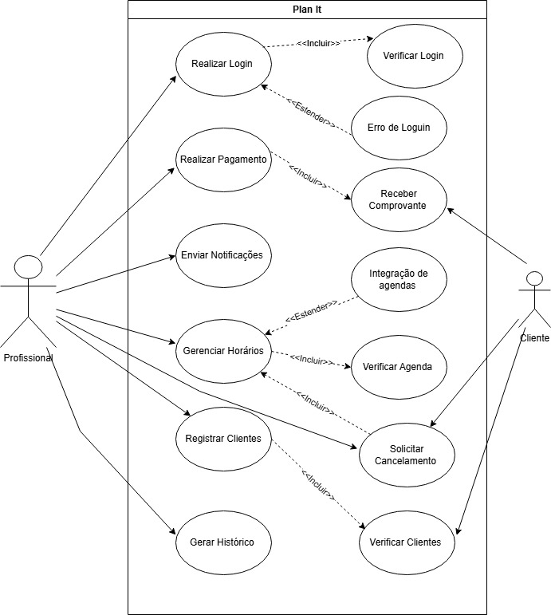
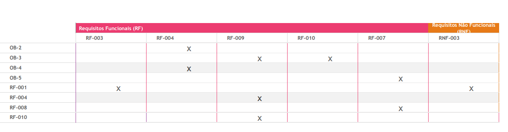
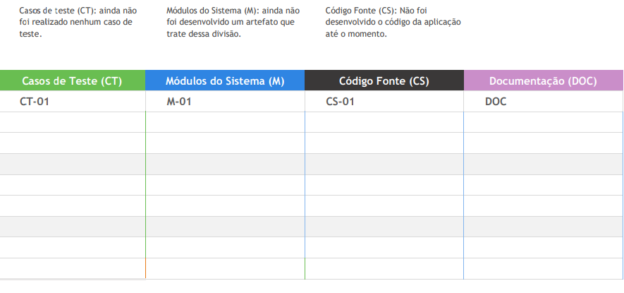
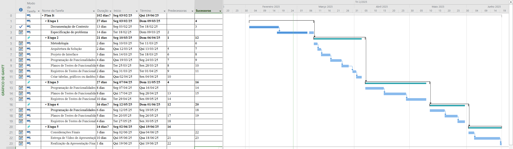
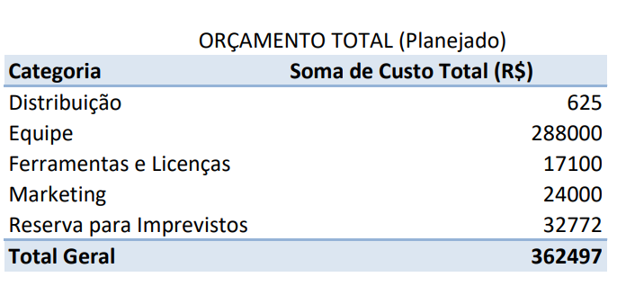

# Especificações do Projeto

Pré-requisitos: <a href="1-Documentação de Contexto.md"> Documentação de Contexto</a>

Definição do problema e ideia de solução a partir da perspectiva do usuário. É composta pela definição do  diagrama de personas, histórias de usuários, requisitos funcionais e não funcionais além das restrições do projeto.

Apresente uma visão geral do que será abordado nesta parte do documento, enumerando as técnicas e/ou ferramentas utilizadas para realizar a especificações do projeto

## Personas

## Persona 1: 

Juliana Andrade – Esteticista Autônoma, tem 32 anos, possui experiência de 8 anos no setor de estética,
enfrenta dificuldades para organizar sua agenda e evitar sobreposições de horários.
Lida com clientes que frequentemente desmarcam de última hora. Precisa de um sistema que ajude a lembrar os clientes dos compromissos. 
Necessita que o sistema tenha agendamento automatizado e lembretes para clientes, facilidade na personalização de horários e serviços e integração com redes sociais para captar novos clientes.

## Persona 2:

Ricardo Mendes – Fisioterapeuta em Clínica Particular, tem 40 anos, possui experiência de 15 anos como fisioterapeuta
Precisa gerenciar uma agenda extensa de pacientes com diferentes tratamentos. Perde tempo reorganizando horários quando pacientes faltam sem aviso.
Quer evitar conflitos de agendamento entre ele e outros profissionais da clínica. Necessita que o sistema permita visualizar e reorganizar compromissos rapidamente,
integração com outras agendas digitais usadas pela clínica e opção de permitir que os próprios clientes remarquem horários dentro de regras pré-definidas.

## Persona 3:

Vanessa Souza – Professora Particular de Inglês, tem 27 anos, possui experiência de 5 anos dando aulas particulares online e presenciais
Precisa equilibrar horários de diferentes alunos sem causar sobreposição. Quer oferecer mais flexibilidade para remarcações sem prejudicar sua organização.
Busca um meio de facilitar pagamentos sem depender de transferências bancárias. Necessita de um sistema que ofereça controle de horários e cancelamentos automáticos,
funcionalidade de pagamento integrado para evitar atrasos e uma interface intuitiva para fácil uso pelos alunos.

## Histórias de Usuários

Com base na análise das personas forma identificadas as seguintes histórias de usuários:

|EU COMO              | QUERO/PRECISO                     |PARA                                    |
|--------------------|------------------------------------|----------------------------------------|
|Juliana Andrade     | Permitir que clientes agendem horários online | Reduzir o tempo gasto com marcações manuais |
|Juliana Andrade     | Integrar minha agenda com redes sociais  | acilitar o agendamento direto pelos clientes |
|Ricardo Mendes      | Oferecer um lembrete automático para consultas | Diminuir faltas dos pacientes|
|Ricardo Mendes      | Permitir reagendamentos dentro de regras pré-definidas | Evitar buracos na minha agenda|
|Vanessa Souza       | Oferecer opção de pagamento recorrente para alunos| Reduzir atrasos e esquecimentos de pagamento|
|Vanessa Souza       | Criar um sistema de lembretes automáticos para aulas| Melhorar a assiduidade dos alunos|

## Modelagem do Processo de Negócio 

### Análise da Situação Atual

A gestão de agendas para profissionais e empresas muitas vezes é feita de maneira manual ou com ferramentas genéricas, o que leva a conflitos de horários, dificuldade no acompanhamento de compromissos e perda de produtividade. A falta de automação nos processos impacta diretamente a organização, resultando em esquecimentos, sobrecarga de tarefas e má experiência para os clientes.

Atualmente, o agendamento de compromissos é realizado por meio de planilhas, anotações manuais ou aplicativos genéricos que não oferecem integração com outras ferramentas essenciais para a gestão do negócio. Esse modelo dificulta a visualização dos horários disponíveis, a comunicação com os clientes e a gestão eficiente do tempo.

### Descrição Geral da Proposta

A proposta da agenda inteligente PlanIt é oferecer uma solução automatizada e eficiente para o gerenciamento de compromissos, integrando funcionalidades como notificações, otimização de horários e sincronização com outras plataformas. O sistema permitirá um controle mais preciso das atividades, reduzindo falhas no agendamento e melhorando a organização. Com isso, busca-se aumentar a produtividade, otimizar o atendimento e proporcionar uma melhor experiência tanto para os profissionais quanto para os clientes.

### Processo 1 – CADASTRO

Oportunidades de melhoria: Simplificação do fluxo de cadastro, redução de campos obrigatórios desnecessários e integração com redes sociais ou outras plataformas para facilitar o registro.

### Processo 2 – CADASTRO DE SERVIÇOS 

Oportunidades de melhoria: Padronização dos serviços cadastrados, possibilidade de categorização e precificação dinâmica com base em demanda e disponibilidade.

### Processo 3 – DISPONIBILIZAÇÃO DE HORÁRIOS 

Oportunidades de melhoria: Interface intuitiva para configuração de horários, bloqueio automático para evitar sobreposição e sincronização com calendário externo.

### Processo 4 - AGENDAMENTO 

Oportunidades de melhoria: Notificações automáticas, confirmação via SMS ou e-mail e possibilidade de pagamento antecipado.

### Processo 5 - REAGENDAMENTO 

Oportunidades de melhoria: Facilidade para modificar horários sem necessidade de cancelamento, regras para evitar mudanças frequentes e readequação automática da agenda.

### Processo 6 - CANCELAMENTO 

Oportunidades de melhoria: Política clara de cancelamento, possibilidade de reembolso e reaproveitamento de horários cancelados para novos agendamentos.

## Indicadores de Desempenho

Os Indicadores de Desempenho são ferramentas essenciais para monitorar e avaliar a eficiência de um sistema de agendamento. Eles ajudam a identificar pontos fortes e áreas de melhoria, garantindo que o app atenda às expectativas dos usuários e aos objetivos do negócio. 

O Indicador de Desempenho pode ser acessado clicando [aqui](https://app.diagrams.net/?src=about#G1fcmARpinDo7sJj2ZcizD_F2_QO09RgPq#%7B%22pageId%22%3A%22pBU9hj_kKMLHwqpSIsB6%22%7D). Abaixo, é possível ver uma representação dele. 

## Requisitos

As tabelas que se seguem apresentam os requisitos funcionais e não funcionais que detalham o escopo do projeto.

### Requisitos Funcionais

|ID    | Descrição do Requisito  | Prioridade |
|------|-----------------------------------------|----|
|RF-001| A aplicação deve permitir criar uma conta | ALTA | 
|RF-002| A aplicação deve permitir a exclusão da conta  | MÉDIA |
|RF-003| A aplicação deve permitir editar o perfil do usuário | MÉDIA | 
|RF-004| A aplicação deve permitir integração com outras agendas digitais | ALTA |
|RF-005| A aplicação deve permitir consultar históricos de agendamentos  | ALTA |
|RF-006| A aplicação deve permitir que o usuário gerencie horários disponíveis  | ALTA |
|RF-007| A aplicação deve permitir gerar um relatório financeiro  | ALTA |
|RF-008| A aplicação deve permitir realizar pagamentos   | MÉDIA |
|RF-009| A aplicação deve permitir um sistema de notificações quando houver conflitos com outras  agendas digitais   | ALTA |
|RF-010| A aplicação deve permitir um sistema de notificações de compromissos agendados  | ALTA |
|RF-011| A aplicação deve permitir que profissionais registre informações dos clientes   | ALTA |
|RF-012| A aplicação deve permitir editar e excluir informações dos clientes   | MÉDIA |

### Requisitos não Funcionais

|ID     | Descrição do Requisito  |Prioridade |
|-------|-------------------------|----|
|RNF-001| O sistema deve ser responsivo para rodar em um dispositivos móvel | MÉDIA | 
|RNF-002| A aplicação deve ter a opção de fazer o login com Google. |  BAIXA | 

## Restrições

O projeto está restrito pelos itens apresentados na tabela a seguir.

|ID| Restrição                                             |
|--|-------------------------------------------------------|
|01| O projeto deverá ser entregue até o final do semestre |
|02| Não pode ser desenvolvido um módulo de backend        |

## Diagrama de Casos de Uso

# Matriz de Rastreabilidade

A matriz de rastreabilidade é uma ferramenta usada para facilitar a visualização dos relacionamento entre requisitos e outros artefatos ou objetos, permitindo a rastreabilidade entre os requisitos e os objetivos de negócio. 

A matriz deve contemplar todos os elementos relevantes que fazem parte do sistema.

 

  <a href="https://sgapucminasbr-my.sharepoint.com/personal/1529238_sga_pucminas_br/_layouts/15/guestaccess.aspx?share=EWbHDemgFjtJnb95vbHL2PMBRtMkHL6NRQ3GZlSMLNnqcQ&e=xIy3vh">Acesso ao Excel da Matriz</a>

> **Links Úteis**:
> - [Artigo Engenharia de Software 13 - Rastreabilidade](https://www.devmedia.com.br/artigo-engenharia-de-software-13-rastreabilidade/12822/)
> - [Verificação da rastreabilidade de requisitos usando a integração do IBM Rational RequisitePro e do IBM ClearQuest Test Manager](https://developer.ibm.com/br/tutorials/requirementstraceabilityverificationusingrrpandcctm/)
> - [IBM Engineering Lifecycle Optimization – Publishing](https://www.ibm.com/br-pt/products/engineering-lifecycle-optimization/publishing/)

# Gerenciamento de Projeto

De acordo com o PMBoK v6 as dez áreas que constituem os pilares para gerenciar projetos, e que caracterizam a multidisciplinaridade envolvida, são: Integração, Escopo, Cronograma (Tempo), Custos, Qualidade, Recursos, Comunicações, Riscos, Aquisições, Partes Interessadas. Para desenvolver projetos um profissional deve se preocupar em gerenciar todas essas dez áreas. Elas se complementam e se relacionam, de tal forma que não se deve apenas examinar uma área de forma estanque. É preciso considerar, por exemplo, que as áreas de Escopo, Cronograma e Custos estão muito relacionadas. Assim, se eu amplio o escopo de um projeto eu posso afetar seu cronograma e seus custos.

## Gerenciamento de Tempo

Com diagramas bem organizados que permitem gerenciar o tempo nos projetos, o gerente de projetos agenda e coordena tarefas dentro de um projeto para estimar o tempo necessário de conclusão.

## Grafico de Gantt

## Gerenciamento de Equipe

O gerenciamento adequado de tarefas contribuirá para que o projeto alcance altos níveis de produtividade. Por isso, é fundamental que ocorra a gestão de tarefas e de pessoas, de modo que os times envolvidos no projeto possam ser facilmente gerenciados. 

Documento Atualizado em: 09/03/2025.

## Gestão de Orçamento

O processo de determinar o orçamento do projeto é uma tarefa que depende, além dos produtos (saídas) dos processos anteriores do gerenciamento de custos, também de produtos oferecidos por outros processos de gerenciamento, como o escopo e o tempo.

Para mais informações sobre o planejamento do orçamento acesse: [Excel do Orçamento](https://sgapucminasbr-my.sharepoint.com/personal/1529238_sga_pucminas_br/_layouts/15/guestaccess.aspx?share=EbvLWm_w7NlOrZR11ES5fzkBHsJJyZ0yqJJVc4EEwm7K-w&e=KGJgbW)
