# Arquitetura da Solução

Pré-requisitos: <a href="3-Projeto de Interface.md"> Projeto de Interface</a>

Definição de como o software é estruturado em termos dos componentes que fazem parte da solução e do ambiente de hospedagem da aplicação.

## Diagrama de Classes

## Modelo ER
Diagrama ER classe

## Esquema Relacional

O Esquema Relacional corresponde à representação dos dados em tabelas juntamente com as restrições de integridade e chave primária.
 
As referências abaixo irão auxiliá-lo na geração do artefato “Esquema Relacional”.

> - [Criando um modelo relacional - Documentação da IBM](https://www.ibm.com/docs/pt-br/cognos-analytics/10.2.2?topic=designer-creating-relational-model)

## Modelo Físico

Entregar um arquivo banco.sql contendo os scripts de criação das tabelas do banco de dados. Este arquivo deverá ser incluído dentro da pasta src\bd.

## Tecnologias Utilizadas

Linguagens e Ambiente de Execução

JavaScript (ES6+): A linguagem principal para desenvolvimento do front-end.

React: Biblioteca para a construção da interface de usuário.

Frameworks e Plataformas

React Native: Framework para desenvolvimento de aplicativos móveis nativos usando JavaScript.

Expo: Ferramenta e plataforma que agiliza o desenvolvimento, teste e publicação de aplicativos React Native.

Bibliotecas e Pacotes

@react-navigation/native, @react-navigation/native-stack e @react-navigation/stack: Bibliotecas para gerenciamento de rotas e navegação entre telas no aplicativo.

expo-auth-session: Biblioteca para autenticação e gerenciamento de sessões.

@react-native-google-signin/google-signin: Integração para permitir o login utilizando a conta Google.

expo-crypto: Utilizada para operações de criptografia dentro do app.

expo-status-bar: Componente para gerenciar a status bar dos dispositivos de forma padronizada.

react-native-safe-area-context e react-native-screens: Auxiliam na criação de layouts que respeitam as áreas seguras dos dispositivos e otimizam a transição entre telas.

react-native-vector-icons: Permite a utilização de ícones vetoriais customizáveis, muito comuns em interfaces modernas.

@expo/metro-runtime: Parte do ecossistema Expo para gerenciamento do bundle via Metro bundler.

Ferramentas e IDEs de Desenvolvimento

Visual Studio Code: Uma das IDEs mais populares para desenvolvimento JavaScript/React Native, que pode ser utilizada para editar e depurar o código.

Node.js: Ambiente de execução para JavaScript no back-end e gerenciamento de pacotes via npm ou yarn.

Git e GitHub: Controle de versão e hospedagem do repositório, facilitando a colaboração e o versionamento do projeto.

Serviços Web e de Build

Expo CLI: Utilizada para iniciar, desenvolver e testar o aplicativo em diversos dispositivos e ambientes (Android, iOS e Web).

Metro Bundler: Bundler padrão utilizado pelo React Native para empacotar os módulos JavaScript do aplicativo.

## Hospedagem

Explique como a hospedagem e o lançamento da plataforma foi feita.

> **Links Úteis**:
>
> - [Website com GitHub Pages](https://pages.github.com/)
> - [Programação colaborativa com Repl.it](https://repl.it/)
> - [Getting Started with Heroku](https://devcenter.heroku.com/start)
> - [Publicando Seu Site No Heroku](http://pythonclub.com.br/publicando-seu-hello-world-no-heroku.html)

## Qualidade de Software

Conceituar qualidade de fato é uma tarefa complexa, mas ela pode ser vista como um método gerencial que através de procedimentos disseminados por toda a organização, busca garantir um produto final que satisfaça às expectativas dos stakeholders.

No contexto de desenvolvimento de software, qualidade pode ser entendida como um conjunto de características a serem satisfeitas, de modo que o produto de software atenda às necessidades de seus usuários. Entretanto, tal nível de satisfação nem sempre é alcançado de forma espontânea, devendo ser continuamente construído. Assim, a qualidade do produto depende fortemente do seu respectivo processo de desenvolvimento.

A norma internacional ISO/IEC 25010, que é uma atualização da ISO/IEC 9126, define oito características e 30 subcaracterísticas de qualidade para produtos de software.
Com base nessas características e nas respectivas sub-características, identifique as sub-características que sua equipe utilizará como base para nortear o desenvolvimento do projeto de software considerando-se alguns aspectos simples de qualidade. Justifique as subcaracterísticas escolhidas pelo time e elenque as métricas que permitirão a equipe avaliar os objetos de interesse.

> **Links Úteis**:
>
> - [ISO/IEC 25010:2011 - Systems and software engineering — Systems and software Quality Requirements and Evaluation (SQuaRE) — System and software quality models](https://www.iso.org/standard/35733.html/)
> - [Análise sobre a ISO 9126 – NBR 13596](https://www.tiespecialistas.com.br/analise-sobre-iso-9126-nbr-13596/)
> - [Qualidade de Software - Engenharia de Software 29](https://www.devmedia.com.br/qualidade-de-software-engenharia-de-software-29/18209/)
