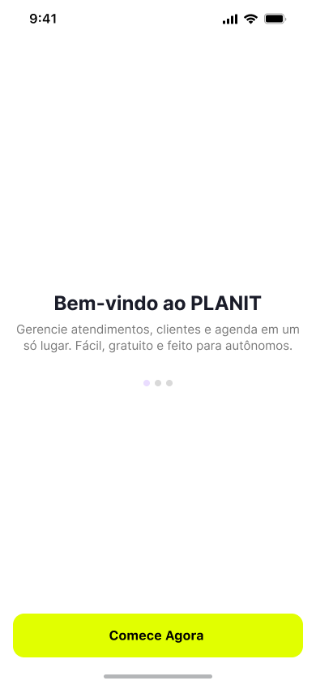
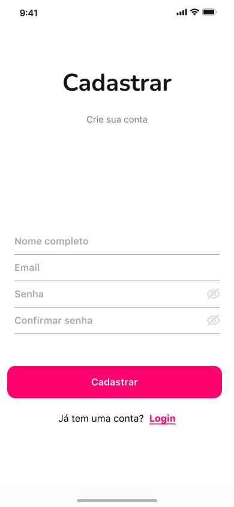
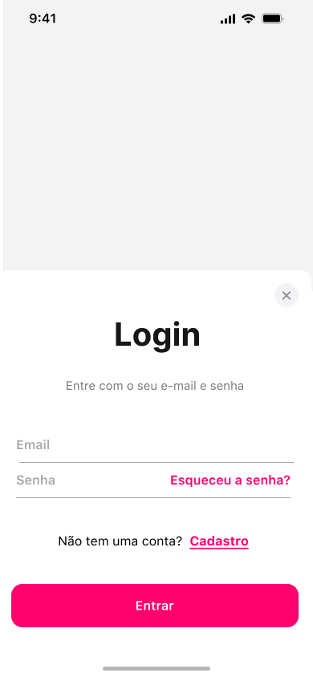
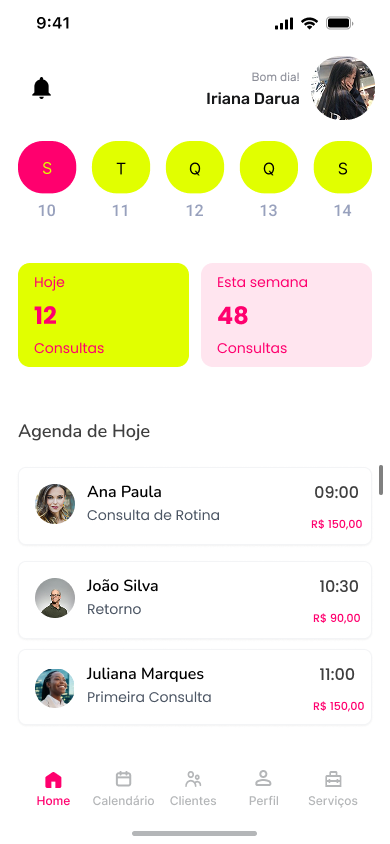
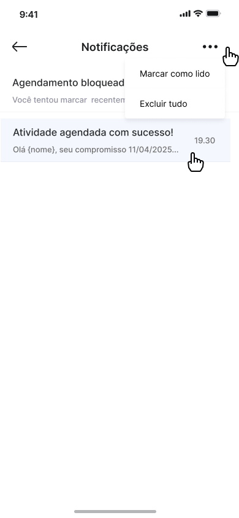
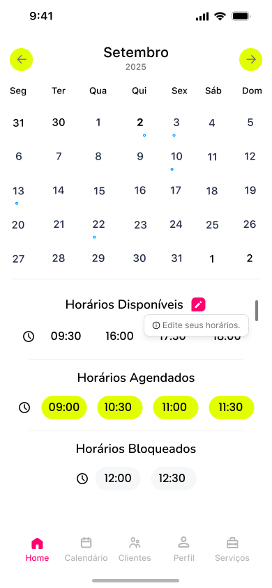
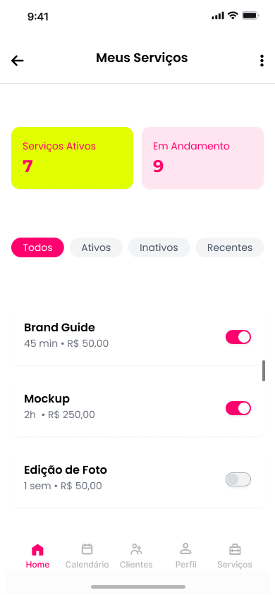

# Template Padrão da Aplicação

Pré-requisitos: <a href="2-Especificação do Projeto.md"> Especificação do Projeto</a>, <a href="3-Projeto de Interface.md"> Projeto de Interface</a>, <a href="4-Metodologia.md"> Metodologia</a>

Layout padrão da aplicação que será utilizado em todas as páginas com a definição de identidade visual, aspectos de responsividade e iconografia.

<h2 align="center">Aplicação Planit - iconografia</h2>

  

<h3 align="center">Boas-vindas</h3>

  

<h3 align="center">Páginas de Login e Cadastro</h3>

  

<h3 align="center">Formulário padrão</h3>

  

  

<h3 align="center">Home e notificações</h3>

 A página inicial exibe uma visão geral das funcionalidades disponíveis. O sistema de notificações informa o usuário sobre compromissos, atualizações e lembretes importantes. 

  

  

<h3 align="center">Calendário e controle de horários</h3>

 O calendário permite visualizar e organizar compromissos de forma clara e objetiva. Já o controle de horários garante a gestão eficiente com foco no microgerenciamento dos dias. 

  

  

<h3 align="center">Histórico de clientes</h3>

 O histórico apresenta todos os atendimentos realizados, oferecendo uma visão detalhada do relacionamento com cada cliente e facilitando o acompanhamento de serviços anteriores. 

  

  

<h3 align="center">Serviços</h3>

 Aqui o usuário pode cadastrar, editar ou remover os serviços oferecidos, além de definir valores, duração e outras informações importantes para o atendimento. 

  

  

  

<h3 align="center">Perfil e configurações</h3>

 No perfil, é possível editar informações pessoais, configurar preferências do sistema e visualizar o perfil profissional, que pode ser exibido para os clientes. 

  

  

  

  

 
<h1 align="center">Guia de Estilo</h2>

  

Desc.: contém os <strong>botões, ícones do react, cores e fontes</strong> usados para mantermos o padrão na aplicação.

